  
    

  
  
  

---

## Projects

<table>
  <tr>
    <td width="50%" valign="top">
      <h3 align="center"><a href="https://github.com/suatkocar/codegraph">CodeGraph</a></h3>
      

        
      

      

        High-performance codebase intelligence engine for AI coding agents. Hybrid search (FTS5 + vector), PageRank ranking, taint analysis, and MCP server.
      

      
Rust · SQLite · tree-sitter · MCP · tokio

    </td>
    <td width="50%" valign="top">
      <h3 align="center"><a href="https://github.com/suatkocar/clear-cache-and-cookies">Clear Cache & Cookies</a></h3>
      

        
      

      

        Chrome extension for one-click cache and cookie clearing. Published on Chrome Web Store.
      

      
TypeScript · Chrome Extensions API · Vite

    </td>
  </tr>
  <tr>
    <td width="50%" valign="top">
      <h3 align="center"><a href="https://github.com/suatkocar/chandelier-height-control">Chandelier Height Control</a></h3>
      

        
      

      

        IoT controller with scheduling, CSV import/export, and real-time WebSocket updates.
      

      
Rust · Axum · Tokio · WebSocket

    </td>
    <td width="50%" valign="top">
      <h3 align="center"><a href="https://github.com/suatkocar/ai-language-tutor">AI Language Tutor</a></h3>
      

        
      

      

        Language learning app with AI chat, speech evaluation, flashcards, and quizzes.
      

      
SvelteKit · TypeScript · OpenAI API

    </td>
  </tr>
  <tr>
    <td width="50%" valign="top">
      <h3 align="center"><a href="https://github.com/suatkocar/food-ordering-system">Food Ordering System</a></h3>
      

        
      

      

        Full-stack app with dynamic menu optimisation, real-time WebSocket updates, Redis caching, and admin dashboard.
      

      
Node.js · React · Redis · MySQL · WebSocket

    </td>
    <td width="50%" valign="top">
      <h3 align="center"><a href="https://github.com/suatkocar/FilmApp">FilmApp</a></h3>
      

        <a href="https://github.com/suatkocar/FilmApp">
          
           
          
        </a>
      

      

        Dynamic and responsive film management SPA consuming the FilmRestful API.
      

      
React · JavaScript · Axios · Bootstrap

    </td>
  </tr>
  <tr>
    <td width="50%" valign="top">
      <h3 align="center"><a href="https://github.com/suatkocar/FilmMVC">FilmMVC</a></h3>
      

        
      

      

        Film management system with Java Servlets and JSP. CRUD operations and external API integration.
      

      
Java · Servlets · JSP · MySQL

    </td>
    <td width="50%" valign="top">
      <h3 align="center"><a href="https://github.com/suatkocar/FilmRestful">FilmRestful</a></h3>
      

        
      

      

        RESTful web service supporting JSON, XML, and TEXT response formats.
      

      
Java · Servlets · Gson · Jakarta XML Bind

    </td>
  </tr>
</table>

  
<b>More Projects</b>

   

  | Project | Description | Tech |
  |---------|-------------|------|
  | [Graph-Based Social Network Analysis](https://github.com/suatkocar/GraphBasedSocialNetworkAnalysis) | Social network analysis using graph data structures | C# |
  | [BST Data Management](https://github.com/suatkocar/BinarySearchTreeDataManagement) | Binary search tree for customer data management | C# |
  | [Queue of Customers](https://github.com/suatkocar/QueueOfCustomers) | Customer queue management system | C# |

---

## Tech I Use

**Languages**

**Frontend**

**Backend & Data**

**Cloud & DevOps**

**AI/ML**

**Tools**

---

## GitHub Stats

  

  
  
  

 

  

 

  

---

  Manchester, UK

